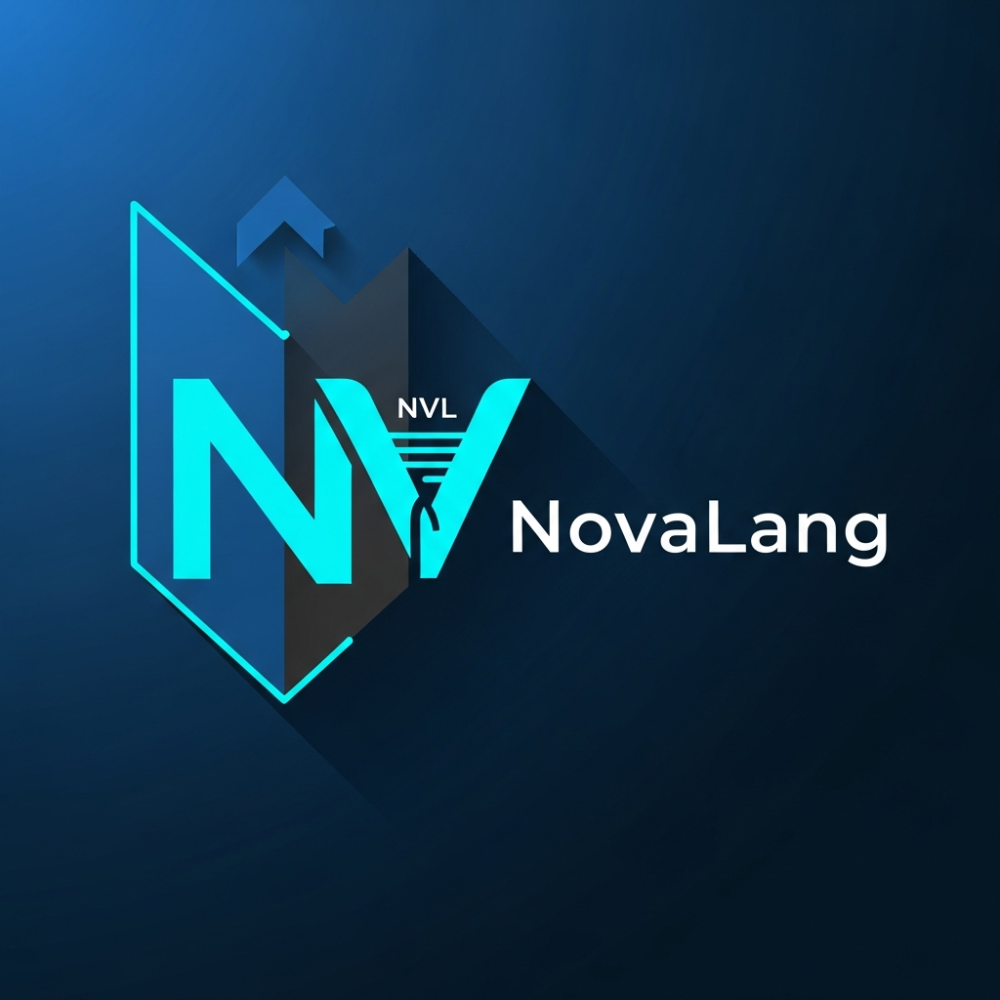

# Coursework Specification

## Title — NovaLang (NVL) Interpreter



## Learning Objectives

You will design and implement a plugin-friendly interpreter for a tiny imperative language (`NovaLang`) using:

+ Sealed interfaces and records for a compact, type-safe instruction model.
+ Pattern matching and modern switch constructs for decode/execute logic.
+ Reflection-based instruction factory (extensible opcodes without modifying core).
+ Virtual threads for concurrent subprograms (async/await).
+ Dependency injection & factories (no hard-coded wiring in the translator).
+ Test-first development with `JUnit 5` (unit + integration), and `JaCoCo` coverage.

## NovaLang Overview

+ Registers: 32 integer registers (r0..r31). Default value: 0.
+ Labels: Any non-whitespace token; must be unique per program line.
+ Program format (one instruction per line):

```
label opcode operands...
```

## Instruction Set (examples):

+ set r x — set register r to constant x.
+ mov r s — copy register[s] into register[r].
+ add r s1 s2 — register[r] = register[s1] + register[s2].
+ sub r s1 s2 — subtraction.
+ mul r s1 s2 — multiplication.
+ div r s1 s2 — integer division (fail on divide-by-zero).
+ print s — print register[s].
+ jnz s L — jump to label L if register[s] != 0.
+ call L — call subroutine labelled L (push return address).
+ ret — return to caller.
+ async L — start a virtual thread that executes from label L until ret.
+ await — wait for all async tasks to complete.
+ sleep ms — sleep current thread for ms milliseconds.
+ halt — terminate the program immediately.

## Required Components

1. Core VM (VM) with:
    + Registers (32 ints), Labels (label→pc), Program (list of com.novalang.instructions),
    + pc (program counter), callStack (for call/ret), asyncTasks management.
1. Instruction model as sealed interface + records per opcode (e.g., `AddInstr`).
1. Translator:
    + Parses lines, validates operands,
    + Uses reflection (with a naming convention) to instantiate instruction classes:
        + Example: add → class `nvl.com.novalang.instructions.AddInstr`
        + Mandatory constructor signature: (String label, int... operands) or specific fields depending on opcode.
        + Injects dependencies via a simple factory/DI interface.
1. Execution:
    + Fetch–decode–execute loop.
    + Virtual threads for async (use `Thread.startVirtualThread`).
    + Safe await/halt.
1. Error handling:
    + Helpful diagnostics (unknown opcode, bad arity, out-of-range register index, divide-by-zero).
1. Testing:
    + Unit tests per instruction (incl. error paths).
    + Integration tests with sample NVL programs (factorial, branching, async demo).
    + Minimum overall coverage: 70% (JaCoCo).
1. Build & Tooling:
    + Gradle project, Java toolchain set to 25+,
    + JUnit 5, JaCoCo, SpotBugs, Checkstyle, PMD, Spotless (optional

## Details

You are provided with the majority of the code, and you must add to this codebase to fulfil the above requirements.

## Submission

+ Your `CODIO` project will be cloned on the deadline.
+ Ensure you have a rich git commit history.
+ Ensure that ./gradlew test and ./gradlew run --args=<program.nvl> work without either failing the tests or
  producing incorrect results.

## Marking Scheme (100 marks)

| Component                            | Marks | Description                                                                                                                         |
|--------------------------------------|-------|-------------------------------------------------------------------------------------------------------------------------------------|
| Correctness (Core VM & Instructions) | 30    | Executes programs correctly; handles branching, call/ret, halt; robust error handling (bad register index, divide-by-zero).         |
| Reflection-based Instruction Factory | 15    | No switch/if chains; opcodes resolved dynamically with reflection & naming convention; constructor handling is clean and validated. |
| Concurrency (async/await)            | 10    | Virtual threads used correctly; awaits all tasks; race-free execution; deterministic tests.                                         |
| Design & DI/Factories                | 10    | Clear separation of concerns; sealed types + records; DI via factory (no tight coupling); maintainability.                          | 
| Testing Quality                      | 15    | Unit + integration tests; coverage ≥ 70% (JaCoCo); meaningful assertions; failure cases covered.                                    |
| Code Quality                         | 20    | Readability, documentation, helpful exceptions; idiomatic modern Java; consistent formatting and naming.                            |

###Penalty notes:

+ −10 if hard-coded switch remains for opcode selection.
+ −10 if tests do not run correctly.
+ −5 if poor documentation.#   S o f t w a r e _ a n d _ P r o g r a m m i n g _ I I I _ C W 2 
 
## Core components to achieve Learning Objectives
1. The Core VM with 32 registers with the additionally features of:
   + integers defaulting to 0
   + labels being utilised
   + a program counter (pc) being used
   + a callStack being utilised (for call/ret)
   + asyncTask management
2. The instruction model is sealed + *every* opocde has a record
3. The translator includes and utilises the following:
   + parses lines whilst validates operands (except two labels on the same line TBC 04-04-26)
   + using reflection and a naming convention to instantiate an instruction classes
     + this just means that ADD == addInstr etc
   + this software *does* include mandatory constructor signatures, dependent on the opcode
   + this software does inject dependencies via the DI interface
4. The execution always uses:
   + fetch-decode-execute loops (or fails)
   + utilises virtual threads for async
   + has safe halts (doesn't crash anymore)
5. This program does tell you exactly what is wrong with a sentence (e.g. unknown opcode)
6. This program does the following:
   + has enough Junit tests to satisfy the JaCoCo tests (79%)
   + the integration tests with the given NVL programs utilising the 'java.com.novaLang.App' file all work with the intended outputs coming out
7. The tests is utilising the following:
   + Gradle: 9.3.1
   + Java: 25.0.2
   + JaCoCo (plugin)
   + SpotBugs (plugin has been intsalled (via the intelliJ market-place and was utilised during the building of this CW))
   + CheckStyle (plug has been installed (via the intelliJ market-place and was utilised at the end of the project ('sun checks')))
   + PMD (####################################)
   + Spotless (####################################)

N.B. There will also be a .zip file with the same files and a file connecting you to my 'personal' but public repository
allowing you (the examiner) to see all my push/commit. 